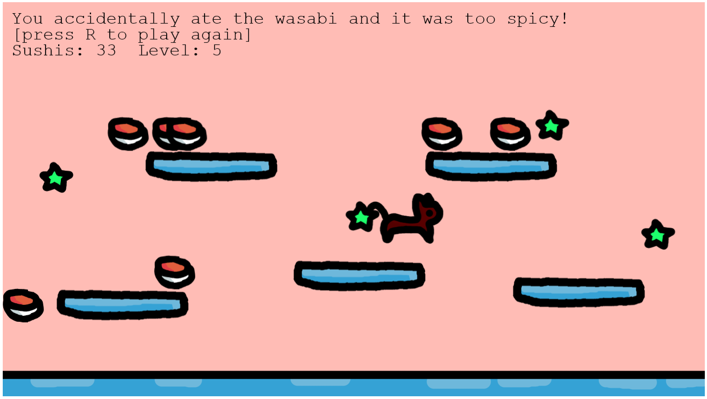

# PhaserPractice

I wanted to learn the JS framework Phaser for making web games, so I followed their tutorial called [Making your first Phaser Game](https://docs.phaser.io/phaser/getting-started/making-your-first-phaser-game). I followed it pretty closely, but I made sure to try and understand what I was doing, because I wanted to actually learn the framework :)

You can play the little game I made on [the game page](https://thedressedmolerat.github.io/PhaserPractice/). The idea is that you (the kitty meow meow) eats all the sushi, but when you're done the sushi reappears but also evil spicy wasabi appears that you have to dodge.

You can use WASD and arrow keys and space to play, and R to restart!

I've used the [Phaser](https://phaser.io/) framwork for the rendering and the physics and the logic :3